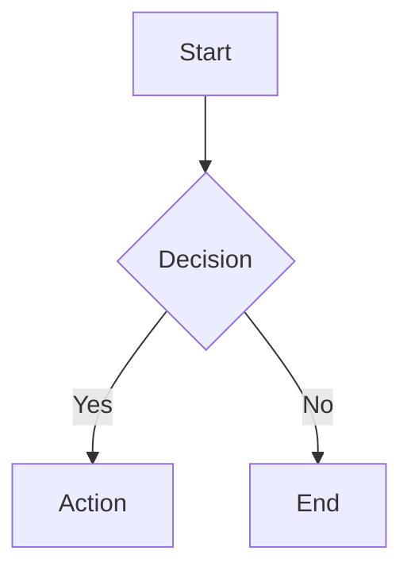

# task58's HOI4 Portal

task58のHearts of Iron IV関連の情報ポータルサイト。Markdownベースで記事を管理します。

## 特徴

- 📝 Markdownで記事を記述
- 🎨 ダークモード/ライトモード切り替え
- 🔢 LaTeX数式表示対応
- 📊 Mermaid図表対応
- 💻 シンタックスハイライト
- 🚀 GitHub Pagesデプロイ対応

## 開発環境のセットアップ

```bash
# 依存関係のインストール
npm install

# 開発サーバーの起動
npm run dev
```

## ビルド

### 開発用ビルド（ローカル用）

```bash
npm run build:dev
```

`dist`フォルダにビルドされます。

### デプロイ用ビルド（GitHub Pages用）

```bash
npm run build:deploy
```

`docs`フォルダにビルドされます。ベースパスが`/task58-hoi4-portal/`に設定されます。

## ベースパスの設定

GitHub Pagesなどのサブディレクトリでホストする場合、[package.json](package.json)の`homepage`フィールドを設定してください：

```json
{
  "homepage": "https://username.github.io/repository-name"
}
```

ビルド時に自動的にURLからパス（`/repository-name/`）が抽出され、正しく設定されます。

ルートドメインでホストする場合は：

```json
{
  "homepage": "https://example.com"
}
```

または`homepage`フィールドを削除すれば、ルートパス（`/`）が使用されます。

## 記事の追加

1. `pages`フォルダにMarkdownファイルを作成（例：`tutorial.md`）
2. ブラウザで`/tutorial`にアクセス

### URLとファイルの対応

- `/` → `pages/index.md`
- `/about` → `pages/about.md`
- `/guide/beginner` → `pages/guide/beginner.md`

## Markdown記法

### コードブロック

````markdown
```typescript
const greeting = "Hello, World!";
console.log(greeting);
```
````

### インラインコード

```markdown
`const example = "code"`
```

### LaTeX数式

インライン数式: `$E = mc^2$`

ブロック数式:

```markdown
$$
\int_{-\infty}^{\infty} e^{-x^2} dx = \sqrt{\pi}
$$
```

### Mermaid図

````markdown

````

## 技術スタック

- React 19
- TypeScript
- Vite
- React Router
- React Markdown
- KaTeX (数式)
- Mermaid (図表)
- react-syntax-highlighter (シンタックスハイライト)

```js
export default defineConfig([
  globalIgnores(['dist']),
  {
    files: ['**/*.{ts,tsx}'],
    extends: [
      // Other configs...

      // Remove tseslint.configs.recommended and replace with this
      tseslint.configs.recommendedTypeChecked,
      // Alternatively, use this for stricter rules
      tseslint.configs.strictTypeChecked,
      // Optionally, add this for stylistic rules
      tseslint.configs.stylisticTypeChecked,

      // Other configs...
    ],
    languageOptions: {
      parserOptions: {
        project: ['./tsconfig.node.json', './tsconfig.app.json'],
        tsconfigRootDir: import.meta.dirname,
      },
      // other options...
    },
  },
])
```

You can also install [eslint-plugin-react-x](https://github.com/Rel1cx/eslint-react/tree/main/packages/plugins/eslint-plugin-react-x) and [eslint-plugin-react-dom](https://github.com/Rel1cx/eslint-react/tree/main/packages/plugins/eslint-plugin-react-dom) for React-specific lint rules:

```js
// eslint.config.js
import reactX from 'eslint-plugin-react-x'
import reactDom from 'eslint-plugin-react-dom'

export default defineConfig([
  globalIgnores(['dist']),
  {
    files: ['**/*.{ts,tsx}'],
    extends: [
      // Other configs...
      // Enable lint rules for React
      reactX.configs['recommended-typescript'],
      // Enable lint rules for React DOM
      reactDom.configs.recommended,
    ],
    languageOptions: {
      parserOptions: {
        project: ['./tsconfig.node.json', './tsconfig.app.json'],
        tsconfigRootDir: import.meta.dirname,
      },
      // other options...
    },
  },
])
```
