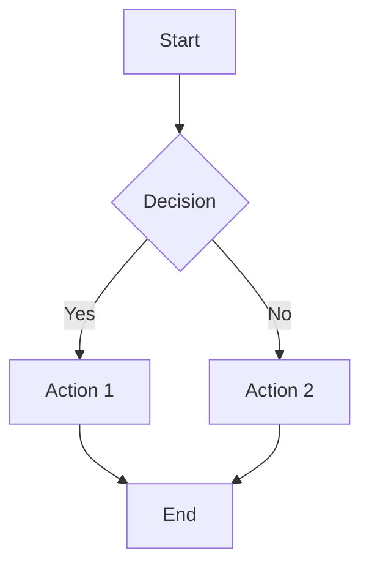

# Welcome to task58's HOI4 Portal

これはHOI4ポータルサイトのトップページです。

## Features

- Markdownで記述
- LaTeX数式対応: $E = mc^2$
- Mermaid図対応
- インラインコード強調: `const example = "code"`
- シンタックスハイライト対応

## Example Code

TypeScriptのサンプルコード:

```typescript
interface Player {
  name: string;
  country: string;
  score: number;
}

function getTopPlayer(players: Player[]): Player | null {
  if (players.length === 0) return null;
  return players.reduce((top, player) => 
    player.score > top.score ? player : top
  );
}

const players: Player[] = [
  { name: "Alice", country: "Germany", score: 1500 },
  { name: "Bob", country: "Japan", score: 1800 },
  { name: "Charlie", country: "USSR", score: 1200 },
];

console.log("Top player:", getTopPlayer(players));
```

Pythonのサンプル:

```python
def fibonacci(n):
    """フィボナッチ数列を生成"""
    a, b = 0, 1
    result = []
    for _ in range(n):
        result.append(a)
        a, b = b, a + b
    return result

# 最初の10個を表示
print(fibonacci(10))
```

JavaScriptのサンプル:

```javascript
// HOI4の国家データ
const countries = {
  GER: { name: "Germany", manpower: 75000 },
  JPN: { name: "Japan", manpower: 50000 },
  USA: { name: "United States", manpower: 120000 }
};

// 総マンパワーを計算
const totalManpower = Object.values(countries)
  .reduce((sum, country) => sum + country.manpower, 0);

console.log(`Total Manpower: ${totalManpower}`);
```

## Example Math

$$
\int_{-\infty}^{\infty} e^{-x^2} dx = \sqrt{\pi}
$$

インライン数式も使えます: $\sum_{i=1}^{n} i = \frac{n(n+1)}{2}$

## Example Mermaid



## Links

- [About](/about)
